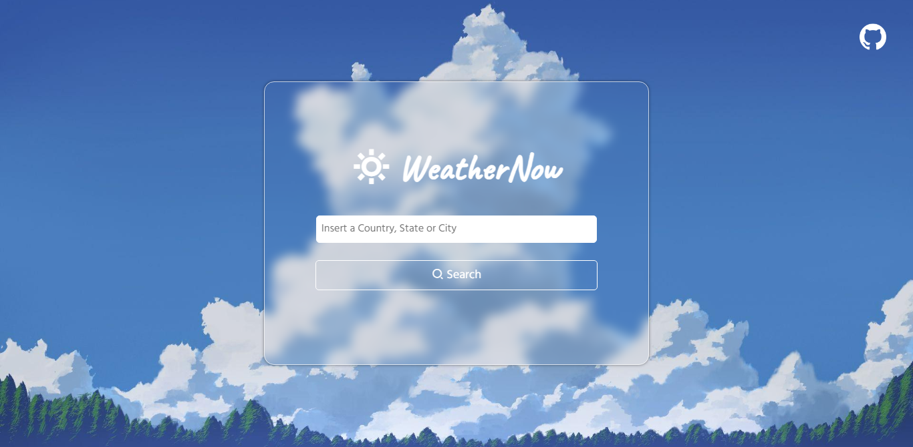
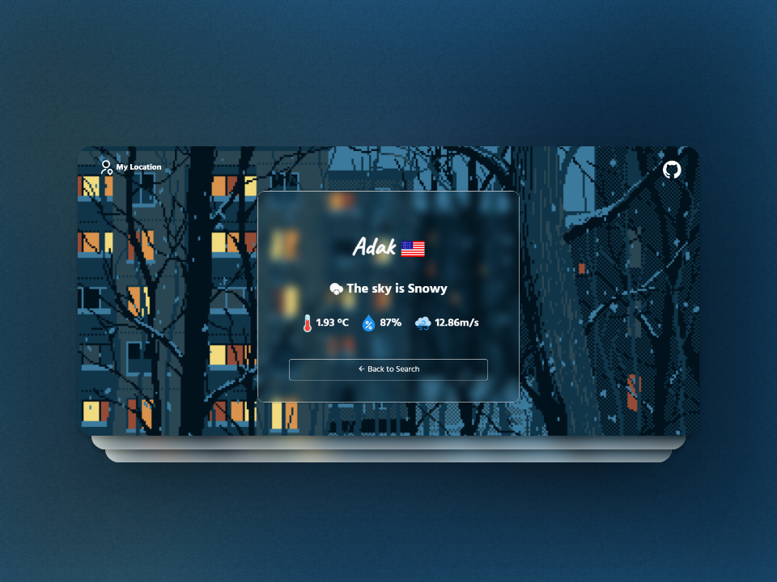
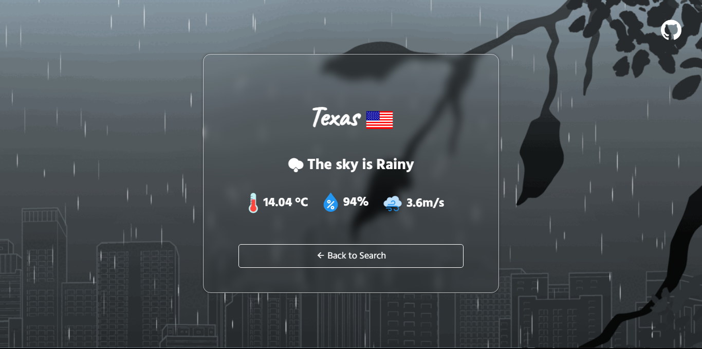

# WeatherNow

Welcome to WeatherNow, your sleek and modern weather web app! 🌦️

## Overview

WeatherNow is a cutting-edge web application designed to provide you with up-to-the-minute weather information in a stylish and intuitive interface. Stay ahead of the elements with a user-friendly experience that combines accurate forecasts, beautiful visualizations, and real-time updates.

## Features

- **Current Conditions:** Get instant access to the latest weather conditions in your location with a glance at the sleek, dynamic and minimalist dashboard.

- **Variety of temperature scales:** Currently, you can display the temperature in the following scales: Celsius, Fahrenheit and Kelvin.

>[!TIP]
>For more precision in searches, enter cities instead of states or countries,

## Screenshots

## Usage

To start using WeatherNow, simply [visit the website](https://steventete.github.io/WeatherNow/index.html) and experience weather updates like never before. No downloads or installations required!

## Feedback

We value your feedback! If you have suggestions or encounter any issues, feel free to [open an issue](https://github.com/StevenTete/weathernow/issues) on our GitHub repository.

## License

WeatherNow is licensed under the [Apache License 2.0](https://opensource.org/licenses/Apache-2.0). Feel free to fork, modify, and share!

---

*WeatherNow - Your Weather, Your Way.*
